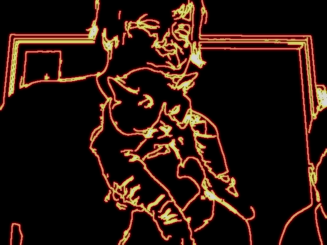

# edge_image
unclear target and background create

## Update!!!
**pose/face mask function added**

# show Edge emphasis image with illumination 

```

python life_lightning.py

```
- other scripts are coloring variation

# sample Image

 


# Pose and face 3D point estimation

- calibration script
  - Generating json file which is recorded face moving
```

python carib_face.py
```

- main script
  
```

python firelight.py

```
- Press s key: you can show Mediapipe poseestimation original screen
- q key is quit script all.

# Example

 


# Requirement 

```
pip install open3d
pip install 
pip install opencv-python numpy


```
